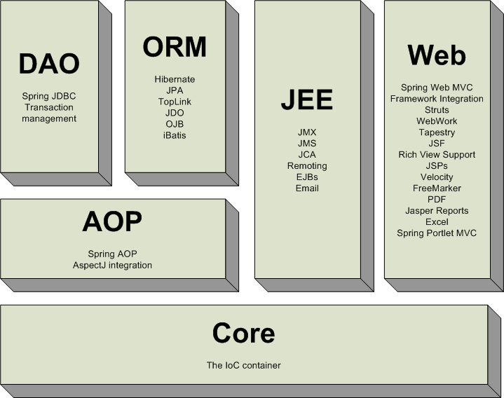
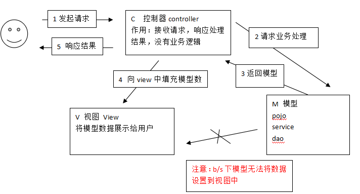
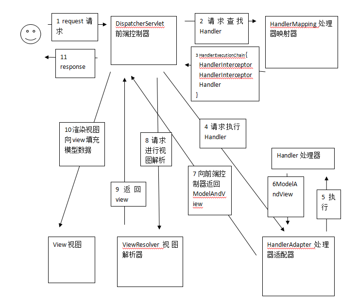

[TOC]

# SpringMVC学习笔记

[SSH与SSM学习之SpringMVC01——SpringMVC简介](blog/01.md)

-----

[TOC]

# SSH与SSM学习之SpringMVC01——SpringMVC简介

## 一、简介

SpringMVC 是spring的一个模块，提供web层解决方案（基于mvc设计架构）

----

## 二、MVC在 B/S系统 中的应用

mvc是一个设计模式，在b/s系统的应用：

1、用户发起request请求至控制器(Controller)
控制接收用户请求的数据，委托给模型进行处理

2、控制器通过模型(Model)处理数据并得到处理结果
模型通常是指业务逻辑

3、模型处理结果返回给控制器

4、控制器将模型数据在视图(View)中展示
web中模型无法将数据直接在视图上显示，需要通过控制器完成。如果在C/S应用中模型是可以将数据在视图中展示的。

5、控制器将视图response响应给用户
通过视图展示给用户要的数据或处理结果。

---

## 三、SpringMVC 架构

第一步：用户发起request请求，请求至DispatcherServlet前端控制器

第二步：
>DispatcherServlet前端控制器请求HandlerMapping处理器映射器查找Handler
>
>DispatcherServlet：前端控制器，相当于中央调度器，各各组件都和前端控制器进行交互，降低了各各组			件之间耦合度。

第三步：
>HandlerMapping处理器映射器，根据url及一些配置规则（xml配置、注解配置）
>
>查找Handler，将Handler返回给DispatcherServlet前端控制器

第四步：
>DispatcherServlet前端控制器调用适配器执行Handler，有了适配器通过适配器去扩展
>
>对不同Handler执行方式（比如：原始servlet开发，注解开发）

第五步：适配器执行Handler。Handler是后端控制器，当成模型。

第六步：
>Handler执行完成返回ModelAndView
>
>ModelAndView：springmvc的一个对象，对Model和view进行封装。

第七步：适配器将ModelAndView返回给DispatcherServlet

第八步：
>DispatcherServlet调用视图解析器进行视图解析，解析后生成view
>
>视图解析器根据逻辑视图名解析出真正的视图。
>
>View：springmvc视图封装对象，提供了很多view，jsp、freemarker、pdf、excel。。。
		
第九步：ViewResolver视图解析器给前端控制器返回view

第十步：DispatcherServlet调用view的渲染视图的方法，将模型数据填充到request域 。

第十一步：DispatcherServlet向用户响应结果(jsp页面、json数据。。。。)

**总结：**
 DispatcherServlet:前端控制器，由 SpringMVC 提供
 
 HandlerMapping:处理器映射器，由 SpringMVC 提供
 
 HandlerAdapter:处理器适配器，由 SpringMVC 提供

**Handler:处理器，需要自己开发**

ViewResolver:视图解析器，由 SpringMVC 提供

**View:真正视图页面需要自己开发**

---

## 四、源码下载

[https://github.com/wimingxxx/springmvcclearn](https://github.com/wimingxxx/springmvcclearn)

