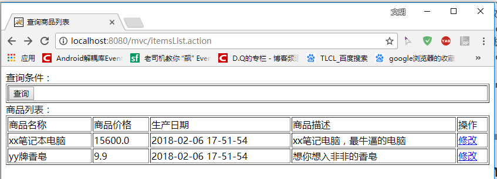

[TOC]

# SSH与SSM学习之SpringMVC02——入门程序

## 一、需求

实现商品列表查询


----

## 二、导入需要的jar包

导入spring包（带 springwebmvc 模块）

这里使用的是 **spring4.3.9**

如图


SpringMVC默认支持 **jstl**


---

## 三、前端控制器

在 web.xml 中配置前端控制器

```xml
<?xml version="1.0" encoding="UTF-8"?>
<web-app xmlns="http://xmlns.jcp.org/xml/ns/javaee"
         xmlns:xsi="http://www.w3.org/2001/XMLSchema-instance"
         xsi:schemaLocation="http://xmlns.jcp.org/xml/ns/javaee http://xmlns.jcp.org/xml/ns/javaee/web-app_3_1.xsd"
         version="3.1">

    <!--前端控制器-->
    <servlet>
        <servlet-name>springmvc</servlet-name>
        <servlet-class>org.springframework.web.servlet.DispatcherServlet</servlet-class>
        <!--加载springmvc配置-->
        <!-- 配置文件的地址
            如果不配置contextConfigLocation，
            默认查找的配置文件名称classpath下的：servlet名称+"-serlvet.xml"即：springmvc-serlvet.xml
         -->
        <init-param>
            <param-name>contextConfigLocation</param-name>
            <param-value>classpath:springmvc.xml</param-value>
        </init-param>
    </servlet>
    <servlet-mapping>
        <servlet-name>springmvc</servlet-name>
        <!--
        可以配置/ ，此工程 所有请求全部由springmvc解析，此种方式可以实现 RESTful方式，需要特殊处理对静态文件的解析不能由springmvc解析
        可以配置*.do或*.action，所有请求的url扩展名为.do或.action由springmvc解析，此种方法常用
        不可以/*，如果配置/*，返回jsp也由springmvc解析，这是不对的。
         -->
        <url-pattern>*.action</url-pattern>
    </servlet-mapping>

</web-app>
```

---

## 四、springmvc.xml

springmvc.xml 

在springmvc.xml中配置springmvc架构三大组件（处理器映射器、适配器、视图解析器）

### 4.1 处理器映射器配置

在springmvc.xml中配置：

BeanNameUrlHandlerMapping： 根据请求url（XXXX.action）匹配spring容器bean的 name
找到对应的bean（程序编写的Handler）

**所有处理器映射器都实现HandlerMapping接口。**

```xml
    <!--配置处理器映射器-->
    <!-- springmvc框架根据HandlerMapping接口判断是否是处理器映射器 -->
    <!-- 根据bean的name进行查找Handler 将action的url配置在bean的name中 -->
    <bean class="org.springframework.web.servlet.handler.BeanNameUrlHandlerMapping"/>
```

### 4.2 适配器

所有的适配器都是实现了HandlerAdapter接口。

这里我们使用的是： ****

```xml
    <!--配置处理器适配器-->
    <bean class="org.springframework.web.servlet.mvc.SimpleControllerHandlerAdapter"/>
```

### 4.3 视图解析器

配置视图解析，能够解析jsp视图

```xml
    <!--配置视图解析器-->
    <bean class="org.springframework.web.servlet.view.InternalResourceViewResolver"/>
```

这里都配置完了，但是我们最重要的 **Handler** 还没有配置，下面我们就来写 Handler 和配置Handler

---

## 五、Handler

### 5.1 要求

编写Handler根据适配器的要求编写。

我们上面使用的是 **SimpleControllerHandlerAdapter**。

SimpleControllerHandlerAdapter适配器要求：

通过supports方法知道Handler必须要实现哪个接口：

```java
	@Override
	public boolean supports(Object handler) {
		return (handler instanceof Controller);
	}
```

要实现 Controller 接口

```java
public interface Controller {
	ModelAndView handleRequest(HttpServletRequest request, HttpServletResponse response) throws Exception;
}
```


### 5.2 Handler编写

这里就不使用数据库，我们就自己模拟两条数据。

```java

/**
 * @author: wiming
 * @date: 2018-02-06 16:06:28  星期二
 * @decription: 商品列表的控制器
 */
public class ItemListController implements Controller {

    @Override
    public ModelAndView handleRequest(HttpServletRequest request, HttpServletResponse response) throws Exception {
        //使用静态数据将商品信息显示在jsp页面上
        //商品列表
        List<Items> itemsList = new ArrayList<>();

        Items items1 = new Items();
        items1.setName("xx笔记本电脑");
        items1.setPrice(15600f);
        items1.setDetail("xx笔记电脑，最牛逼的电脑");
        items1.setCreatetime(new Date());

        Items items2 = new Items();
        items2.setName("yy牌香皂");
        items2.setPrice(9.9f);
        items2.setDetail("想你想入非非的香皂");
        items2.setCreatetime(new Date());

        itemsList.add(items1);
        itemsList.add(items2);

        //创建ModelAndView
        ModelAndView modelAndView = new ModelAndView();
        //添加数据
        modelAndView.addObject("itemsList",itemsList);
        //指定跳转的界面
        modelAndView.setViewName("/WEB-INF/jsp/itemsList.jsp");

        return modelAndView;
    }
}
```


### 5.3 配置Handler

在springmvc.xml配置Handler由spring管理Handler。

```xml
    <!--  配置handler
    由于使用了BeanNameUrlHandlerMapping处理映射器，name配置为url-->
    <bean name="/itemList.action" class="com.qwm.springmvcclearn.controller.ItemListController"/>

```

---

## 六、测试




----

## 七、源码下载


[https://github.com/wimingxxx/springmvcclearn](https://github.com/wimingxxx/springmvcclearn)
